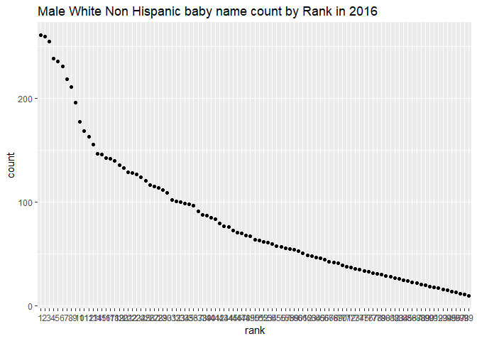

p8105\_hw2\_sl4269
================
Steven Lawrence
September 28, 2019

Problem 1
=========

Loading libraries

``` r
library(tidyverse)
```

Importing the Data sets
-----------------------

Cleaning Mr.trash data

``` r
mr.trash <-
  readxl::read_excel("./data/HealthyHarborWaterWheelTotals2018-7-28.xlsx", na = "", trim_ws = T, skip = 1, sheet = 1) %>% 
  janitor::clean_names() %>% 
  drop_na(dumpster)%>%
  mutate(sports_balls = sports_balls %>% round(digits =0) %>% as.numeric())
```

Cleaning and merging precipitation data sets

``` r
##precipitation is in inches
precip17<- 
  readxl::read_excel("./data/Trash-Wheel-Collection-Totals-8-6-19.xlsx", na= "", trim_ws = T, skip = 1, sheet = 6) %>% 
  janitor::clean_names() %>% 
  drop_na(total)%>%
  mutate(year = "2017", month = month.name[month])

precip18<- 
  readxl::read_excel("./data/Trash-Wheel-Collection-Totals-8-6-19.xlsx", na= "", trim_ws = T, skip = 1, sheet = 5) %>% 
  janitor::clean_names() %>% 
  drop_na(total)%>%
  mutate(year = "2018", month = month.name[month])

precip18_and_17 <- rbind(precip17, precip18)

precip_by_year<- precip18_and_17 %>% 
  pivot_wider(
              names_from = year,
              values_from = total)
precip_by_year$month[13]<- "Total precipitation"
```

### Datadiscription

The `precip18_and_17` dataset contains precipitation data of 2017 and 2018. The dimentions of this dataset is `13x3` where the 13th row is total precipiation. For the available data the total precipitation of 2018 was 70.33 and the median number of sports balls in the dumpster in 2017 is 8.

Problem 2
=========

``` r
polls <- 
  read_csv("data/pols-month.csv") %>% 
  janitor::clean_names() %>% 
  separate(mon, c('year', 'month', 'day') ) %>% 
  mutate(
    month = month.abb[as.numeric(month)] %>% tolower(), 
    president = prez_gop + prez_dem 
    ) %>% 
  select(year, month, president, everything(), -day, - prez_gop, -prez_dem) %>% 
  arrange(year, month)

snp <- 
  read_csv("data/snp.csv") %>% 
  janitor::clean_names() %>% 
  separate(date, c("month","day","year")) %>% 
  mutate( 
    month= month.abb[as.numeric(month)] %>% tolower()
  ) %>% 
  select(year, month, everything()) %>% 
  arrange(year,month)

unemployed <- 
  read_csv("data/unemployment.csv") %>% 
  janitor::clean_names() %>% 
  mutate(
    year = as.character(year)
  ) %>% 
  pivot_longer(
    jan:dec,
    names_to = "month",
    values_to = "unemployment"
  ) %>% 
  arrange(year,month)

polls_snp<- merge(polls, snp, by = c("year","month")) 

polls_snp_umemployed <- left_join(polls_snp, unemployed, by = c("year", "month")) %>% 
  select(everything(), - day)

view(polls_snp_umemployed)

dim(polls_snp_umemployed
    )
```

    ## [1] 786  11

The polls data set contains poll information from all the branches of government from the time of `1947 - 2015`. The dimenstion of this dataset is `822 by 9`. The snp data set contains information about the number of retracted peer reviewed papers from `1950 - 2015` with a dimension of `787 by 4`. Lastly, the unemployed dataset contains information of unemployment percentages from years `1948 - 2015` and dimentions of `816 to 3`. When the data sets combined, thet are filtered by the time period`1950 - 2015` and the dimensions are `786 by 11`.

Problem 3
=========

Loading in data set and cleaning it

``` r
Baby_names <- 
  read_csv("./data/Popular_Baby_Names.csv") %>% 
  janitor::clean_names() %>% 
  distinct() %>% 
  mutate(rank = as.factor(rank))
```

    ## Parsed with column specification:
    ## cols(
    ##   `Year of Birth` = col_double(),
    ##   Gender = col_character(),
    ##   Ethnicity = col_character(),
    ##   `Child's First Name` = col_character(),
    ##   Count = col_double(),
    ##   Rank = col_double()
    ## )

Table of Olivai's rank over time and ethnicity.

``` r
baby_olivia<- 
  Baby_names %>% 
  filter(childs_first_name =="Olivia") %>% 
  group_by(ethnicity, year_of_birth) 
  baby_olivia<- baby_olivia[order(pull(baby_olivia,rank)),] 
  baby_olivia %>% 
  knitr::kable(digits = 1)
```

|  year\_of\_birth| gender | ethnicity                  | childs\_first\_name |  count| rank |
|----------------:|:-------|:---------------------------|:--------------------|------:|:-----|
|             2016| FEMALE | ASIAN AND PACIFIC ISLANDER | Olivia              |    172| 1    |
|             2016| FEMALE | WHITE NON HISPANIC         | Olivia              |    230| 1    |
|             2015| FEMALE | ASIAN AND PACIFIC ISLANDER | Olivia              |    188| 1    |
|             2015| FEMALE | WHITE NON HISPANIC         | Olivia              |    225| 1    |
|             2014| FEMALE | ASIAN AND PACIFIC ISLANDER | Olivia              |    141| 1    |
|             2014| FEMALE | WHITE NON HISPANIC         | Olivia              |    248| 1    |
|             2013| FEMALE | WHITE NON HISPANIC         | Olivia              |    233| 1    |
|             2013| FEMALE | ASIAN AND PACIFIC ISLANDER | Olivia              |    109| 3    |
|             2015| FEMALE | BLACK NON HISPANIC         | Olivia              |     82| 4    |
|             2013| FEMALE | BLACK NON HISPANIC         | Olivia              |     64| 6    |
|             2016| FEMALE | BLACK NON HISPANIC         | Olivia              |     49| 8    |
|             2014| FEMALE | BLACK NON HISPANIC         | Olivia              |     52| 8    |
|             2016| FEMALE | HISPANIC                   | Olivia              |    108| 13   |
|             2015| FEMALE | HISPANIC                   | Olivia              |     94| 16   |
|             2014| FEMALE | HISPANIC                   | Olivia              |     96| 16   |
|             2013| FEMALE | HISPANIC                   | Olivia              |     87| 22   |

Table of most popular male names.

``` r
baby_popular_male_name <-
  Baby_names %>% 
  filter(gender == "MALE", rank == 1)

baby_popular_male_name <- 
  baby_popular_male_name[
    order(
      pull(
        baby_popular_male_name,-rank)
      ),
    ]

baby_popular_male_name %>% 
  knitr::kable(digits = 1)
```

|  year\_of\_birth| gender | ethnicity                  | childs\_first\_name |  count| rank |
|----------------:|:-------|:---------------------------|:--------------------|------:|:-----|
|             2011| MALE   | ASIAN AND PACIFIC ISLANDER | ETHAN               |    177| 1    |
|             2011| MALE   | BLACK NON HISPANIC         | JAYDEN              |    184| 1    |
|             2011| MALE   | HISPANIC                   | JAYDEN              |    426| 1    |
|             2011| MALE   | WHITE NON HISPANIC         | MICHAEL             |    292| 1    |
|             2012| MALE   | ASIAN AND PACI             | RYAN                |    197| 1    |
|             2012| MALE   | BLACK NON HISP             | JAYDEN              |    171| 1    |
|             2012| MALE   | HISPANIC                   | JAYDEN              |    364| 1    |
|             2012| MALE   | WHITE NON HISP             | JOSEPH              |    300| 1    |
|             2013| MALE   | ASIAN AND PACIFIC ISLANDER | Jayden              |    220| 1    |
|             2013| MALE   | BLACK NON HISPANIC         | Ethan               |    146| 1    |
|             2013| MALE   | HISPANIC                   | Jayden              |    352| 1    |
|             2013| MALE   | WHITE NON HISPANIC         | David               |    304| 1    |
|             2014| MALE   | ASIAN AND PACIFIC ISLANDER | Jayden              |    187| 1    |
|             2014| MALE   | BLACK NON HISPANIC         | Ethan               |    138| 1    |
|             2014| MALE   | HISPANIC                   | Liam                |    312| 1    |
|             2014| MALE   | WHITE NON HISPANIC         | Joseph              |    300| 1    |
|             2015| MALE   | ASIAN AND PACIFIC ISLANDER | Jayden              |    190| 1    |
|             2015| MALE   | BLACK NON HISPANIC         | Noah                |    163| 1    |
|             2015| MALE   | HISPANIC                   | Liam                |    356| 1    |
|             2015| MALE   | WHITE NON HISPANIC         | David               |    299| 1    |
|             2016| MALE   | ASIAN AND PACIFIC ISLANDER | Ethan               |    193| 1    |
|             2016| MALE   | BLACK NON HISPANIC         | Noah                |    148| 1    |
|             2016| MALE   | HISPANIC                   | Liam                |    387| 1    |
|             2016| MALE   | WHITE NON HISPANIC         | Joseph              |    261| 1    |

Scatter plot of male, white non-hispanic, baby name observastions along wtih their rank.

``` r
baby_male_name_scatterplot <-
  Baby_names %>% 
  filter(gender == "MALE", ethnicity == "WHITE NON HISPANIC", year_of_birth == 2016) %>% 
  ggplot(aes(x = rank, y = count))+geom_point()+labs(title = "Male White Non Hispanic baby name count by Rank in 2016")

baby_male_name_scatterplot
```


